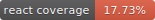

# Everything2




Everything2 is a user-submitted content website emphasizing writing and connectivity between entries. Visit us at [everything2.com](https://everything2.com).

## Getting Started

**Quick start for developers:**

```bash
# Install Docker Desktop, then:
./docker/devbuild.sh

# Visit http://localhost:9080
```

See [docs/GETTING_STARTED.md](docs/GETTING_STARTED.md) for complete development setup.

## Architecture

- **Backend:** Perl + Moose on **PSGI/Plack** (Starman), behind **Apache2 (mpm_event)** as a pure
  reverse proxy + edge compression — **mod_perl and CGI.pm fully removed**. **MySQL 8.4 LTS**.
- **Frontend:** React 18.3 + Webpack 5 (jQuery fully retired; legacy Mason templates fully retired)
- **Infrastructure:** AWS Fargate ECS, CodeBuild CI/CD, S3 asset storage, RDS MySQL
- **Development:** Docker containers (`e2devapp`, `e2devdb`) with automated testing

## Repository Structure

| Directory | Purpose |
|-----------|---------|
| [ecore/](ecore/) | Core Everything libraries (Perl/Moose OOP) |
| [react/](react/) | React 18 frontend components |
| [www/](www/) | Static web assets (CSS, JS, images) |
| [t/](t/) | Test suite (automated in build) |
| [docker/](docker/) | Development and production containers |
| [nodepack/](nodepack/) | Node/schema artifacts (XML dumps from production) |
| [tools/](tools/) | Puppeteer/Perl utilities for debugging, coverage, layout checks |
| [docs/](docs/) | **Comprehensive documentation and guides** |

[View all directories →](docs/GETTING_STARTED.md#repository-structure)

## Documentation

### For Developers
- **[Getting Started](docs/GETTING_STARTED.md)** — Development setup and workflow
- **[Coding Standards](docs/coding-standards.md)** — Perl/JavaScript style guide
- **[Quick Reference](docs/quick-reference.md)** — Common commands and patterns
- **[Code Coverage Guide](docs/code-coverage.md)** — Coverage tooling and methodology

### Strategy & Architecture
- **[Developer Roadmap](docs/DEVELOPER-ROADMAP.md)** ⭐ — Strategic priorities, phase sequencing, current status
- **[Modernization Epoch Tree](docs/modernization-dependency-tree.md)** — Dependency ordering of the deferred work (what unblocks what)
- **[MySQL 8.4 Migration Plan](docs/mysql-migration-plan.md)** — ✅ Done (migrated 2026-06-07)
- **PSGI/Plack migration** — ✅ Shipped (live in prod 2026-06-08); mod_perl removed (original plan in git history)
- **[Plack::Request Migration](docs/plack-request-migration.md)** — ✅ CGI.pm removed (request + response layers)
- **[API-Driven Architecture](docs/api-driven-architecture.md)** — Next epoch: return-based responses, PageState, 100%-API
- **[ORM Migration Plan](docs/orm-migration-plan.md)** — NodeBase modernization strategy (deferred)
- **[Infrastructure Overview](docs/infrastructure-overview.md)** — AWS/Docker deployment
- **[React Analysis](docs/react-analysis.md)** — Frontend implementation notes

**[Browse all documentation →](docs/README.md)**

## Current Modernization Status

| Workstream | Status | Notes |
|------------|--------|-------|
| SQL Injection Audit | ✅ Complete | Apr 2026 audit: zero remaining vulnerable sites |
| jQuery Removal | ✅ Complete | Fully retired; React covers all interactive UI |
| Mason Template Removal | ✅ Complete | `templates/` no longer carries server-rendered views |
| Inline-styles → BEM CSS Refactor | ✅ Landed | ~280-file refactor merged Apr–May 2026 |
| Mobile Redesign | ✅ Shipped | Bottom-nav layout, mobile audit tooling in `tools/` |
| Date/Timezone Standardization | ✅ Done | 18 components migrated to `react/utils/dateFormat.js` |
| Testing Infrastructure | ✅ Stable | Automated via `./docker/devbuild.sh` |
| Code Coverage | ✅ Tracked | Perl 53.1% / React 17.7% (as of 2026-06-15) |
| **MySQL 8.4 Migration** | ✅ Done | Migrated 2026-06-07 (#4226), ahead of the July 2026 RDS deadline |
| **PSGI/Plack Migration** | ✅ Shipped | Live in prod 2026-06-08; mod_perl removed, Apache on mpm_event, Starman serving |
| **CGI.pm Removal** | ✅ Done | Request via `Everything::Request::PlackQuery`, response via `Everything::Response`; CGI dropped from deps + vendor cache |
| **Security-Log Decoupling** | ✅ Done | `seclog` moved off node identity to the `Everything::SecurityLog` enum (`seclog_event`); all writer callers use `SECLOG_*` constants (#4272) |
| **React Routing Epic** | 🔄 In progress | Destination: full client-side routing. Gated on retiring server-side request processing — opcode→API (#4198), opcode kills (#4299), page form-handling (#4298), htmlcode burndown (#4300), API CSRF guard (#4301). Pagestate facade (#4255/#4257) mostly done. |
| DBIx::Class / Schema Migrations | 📋 Deferred | Modernize NodeBase in place first; sqitch for versioned migrations. Pull forward only if the data model hurts |

See [coverage/COVERAGE-SUMMARY.md](coverage/COVERAGE-SUMMARY.md) for coverage details and [docs/DEVELOPER-ROADMAP.md](docs/DEVELOPER-ROADMAP.md) for full sequencing rationale.

## Testing

Tests run automatically during `./docker/devbuild.sh`. To run manually:

```bash
./docker/run-tests.sh              # Run all tests
./docker/run-tests.sh 012          # Run specific test
./docker/run-tests.sh sql          # Run tests matching pattern
./tools/coverage.sh                # Run tests with code coverage
```

**Current Status:** All tests passing; Perl::Critic checks passing.

**Code Coverage:**  

Coverage is tracked via Devel::Cover (Perl) and Jest (React). Badges update automatically during `./docker/devbuild.sh --coverage` runs. See [coverage/COVERAGE-SUMMARY.md](coverage/COVERAGE-SUMMARY.md) for detailed reports and [docs/code-coverage.md](docs/code-coverage.md) for methodology.

## Contributing

1. Fork the repository
2. Create a [GitHub issue](https://github.com/everything2/everything2/issues) (if one doesn't exist)
3. Create a feature branch: `issue/ISSUE_NUMBER/short-description`
4. Follow [Coding Standards](docs/coding-standards.md)
5. Add tests for new features
6. Ensure all tests pass (`./docker/run-tests.sh`)
7. Submit a pull request referencing the issue

**Branch naming convention:** `issue/ISSUE_NUMBER/short-description`
- Example: `issue/4048/new-writeups-anchor`

See [Contributing Guide](docs/GETTING_STARTED.md#contributing) for full details.

## Technology Stack

**Backend:**
- Perl 5.40 with Moose (Ubuntu 26.04 LTS base)
- **PSGI/Plack** served by **Starman**, behind **Apache2 (mpm_event)** as a pure reverse proxy + edge compression — no mod_perl, no CGI.pm
- Request layer: `Everything::Request::PlackQuery` (Plack::Request) · Response layer: `Everything::Response` (Plack::Response)
- **MySQL 8.4 LTS**
- DBI with native `connect_cached` for connection reuse (`Apache::DBI` removed, #4228)

**Frontend:**
- React 18.3 (~80 top-level components + ~250 Document components)
- Webpack 5 asset bundling
- DOMPurify for sanitized HTML rendering
- Shared utilities under `react/utils/` (e.g. `dateFormat.js`)

**Infrastructure:**
- AWS Fargate ECS (container orchestration)
- AWS CodeBuild (CI/CD)
- AWS RDS MySQL
- AWS S3 (asset storage with versioning)
- Cloudflare (CDN/edge)

**Development:**
- `cpanfile` + Carton snapshot (Perl deps; installed offline from a vendored cpanm cache)
- npm (Node.js dependencies)
- Test::More + Devel::Cover (Perl testing & coverage)
- Jest (React testing & coverage)
- Perl::Critic (code quality)
- Puppeteer-based debugging tools in `tools/`

## Security

If you discover a security vulnerability:

1. **Do NOT** open a public GitHub issue
2. Contact the maintainer privately at jay@bonci.net

**Recent Security Work:**
- ✅ April 2026 SQL injection re-audit: zero vulnerable sites remaining
- ✅ Test coverage in place for security-sensitive code paths
- ✅ Security-log decoupling (#4272): `seclog` keyed off a stable event enum, not node identity
- 🛡️ CSRF posture: session cookie is `SameSite=Lax` (blocks cross-site POST); a belt-and-suspenders
  API-wide Origin/header guard is specced (#4301) to land as the API-driven cleanout finishes —
  invariant: **no mutation is served by GET**
- 🔄 Ongoing: NodeBase modernization to eliminate raw-SQL call sites in controllers

## License

This project is licensed under the same terms as Perl itself, under either:

* The GNU General Public License as published by the Free Software Foundation; either version 1, or (at your option) any later version, or
* The Artistic License

See the Perl documentation for details on these licenses.

## Links

- **Website:** [everything2.com](https://everything2.com)
- **Issues:** [GitHub Issues](https://github.com/everything2/everything2/issues)
- **Documentation:** [docs/](docs/) directory
