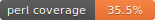
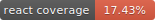

# Everything2 Code Coverage Summary

**Last Updated**: 2026-01-04 11:10:55

## Overall Coverage

| Language | Coverage | Status |
|----------|----------|--------|
|  | 38.9% | ⚠️ Needs Improvement |
|  | 18.26% | ⚠️ Needs Improvement |

## Perl Coverage Details

**Total Statement Coverage**: 38.9%

Coverage data tracked from mock-based API tests. See [code-coverage.md](../docs/code-coverage.md) for full details.

📊 **[View Detailed Perl Module Coverage Report](PERL-MODULE-COVERAGE.md)** - Module-by-module breakdown

**To regenerate coverage**:
```bash
./tools/coverage.sh              # Run full test suite with coverage
./tools/generate-coverage-badges.sh  # Update badges and reports
```

## React Coverage Details

**Total Line Coverage**: 18.26%

Coverage data from Jest test suite.

📊 **[View Detailed React Module Coverage Report](REACT-MODULE-COVERAGE.md)** - Component-by-component breakdown

**To regenerate coverage**:
```bash
npm test -- --coverage           # Run Jest with coverage
./tools/generate-coverage-badges.sh  # Update badges and reports
```

## Coverage Goals

### Current (Dec 2025)
- ✅ Perl: 38.9% (mock-based tests working)
- ✅ React: 18.26% (Jest infrastructure ready)

### Short-term Goals (Q1 2026)
- 🎯 Perl: 40% (comprehensive API testing)
- 🎯 React: 60% (component test coverage)

### Long-term Goals (2026)
- 🎯 Perl: 70% (after PSGI migration enables full coverage)
- 🎯 React: 80% (full component coverage)

## How Coverage Works

### Perl Coverage (Devel::Cover)
- **Mock-based tests**: ✅ Coverage tracked successfully
- **Integration tests**: ✅ Coverage tracked for test-loaded modules
- **Request handlers**: ⏳ Limited coverage (mod_perl architecture)
- **Full coverage**: Requires PSGI/Plack migration (Phase 7)

### React Coverage (Jest)
- **Unit tests**: Coverage tracked via Istanbul/NYC
- **Component tests**: @testing-library/react integration
- **Snapshot tests**: Coverage for render paths

## Recent Coverage Changes

Generated automatically during `./docker/devbuild.sh` runs (when not using `--skip-tests`).

See `coverage/html/coverage.html` for detailed Perl coverage report.
See `coverage/react/lcov-report/index.html` for detailed React coverage report.

---

**Note**: This document is auto-generated by `tools/generate-coverage-badges.sh`
